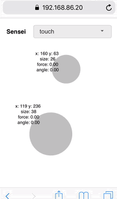
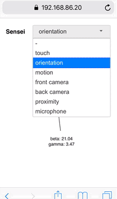
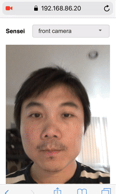

# Sensei
Sensei is your one stop shop of getting to know what sensors are available to play with on your phone. It runs as a web app, making it code reusable across Mobile OS platforms.

## How to run
Make sure your phone and the machine that runs sensei are under the same wireless network, and finds out the machine's [local IP address] (https://lifehacker.com/5833108/how-to-find-your-local-and-external-ip-address).

After downloading or cloning the repo:
```shell
cd sensei-master
./serverup 9999
```

Open the browser on your phone, navigate to https://<machine_ip_address>:9999. You will encounter some security warning depending on which browser you use. By pass them and you will see the Sensei.

        
